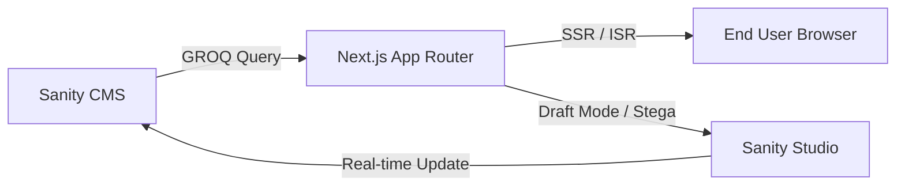

# Transetu-Garuda: Enterprise Headless Architecture Documentation

**Version**: 1.1  
**Project**: Garuda OM Website  
**Architect**: Technical Documentation Lead  
**Date**: April 8, 2026

---

## 1. PROJECT OVERVIEW

### Purpose
The **Transetu-Garuda** project (Garuda OM) is a premium, high-performance web platform built to serve as the digital storefront for GPS Tracking and FASTag solutions. The primary goal is to provide a lightning-fast, SEO-optimized, and highly maintainable site where content can be updated in real-time by non-technical stakeholders without developer intervention.

### High-Level Architecture
The project employs a modern **Headless Architecture**, decoupling the content (Sanity CMS) from the presentation layer (Next.js).

### Integration Strategy
The integration is built on **Dynamic Data Fetching**. Unlike traditional static sites, this project uses Next.js **Server Components** to fetch data directly from Sanity at request time or through Incremental Static Regeneration (ISR). This allows for near-instant updates while maintaining the performance benefits of a static site.

---

## 2. TECH STACK

| Layer | Technology | Role & Rational |
| :--- | :--- | :--- |
| **Frontend** | **Next.js 14+ (App Router)** | Used for its superior performance, SEO capabilities, and unified routing/API system. |
| **CMS** | **Sanity CMS** | Chosen for its "Content as Data" philosophy and highly customizable Studio. |
| **Languages** | **TypeScript** | Enforces strict type-safety, which is critical for handling varied CMS data structures. |
| **Styling** | **Tailwind CSS** | Facilitates a unified design system and prevents CSS bloat through utility-first classes. |
| **Integration** | **next-sanity** | The official toolkit for image optimization, client config, and live preview logic. |
| **Animations** | **Framer Motion** | Powers smooth entrance animations and micro-interactions for a "premium" feel. |

---

## 3. FOLDER STRUCTURE

The repository follows a clean, highly structured layout designed for scalability.

### Core Directories
- **`src/app/`**: The heart of the application.
  - `(routes)`: Defines the URL structure (e.g., `fastag/`, `solutions/`).
  - `api/`: Server-side endpoints. 
    - `api/preview`: Securely bridges Sanity and Next.js for draft mode.
    - `api/contact`: Handles secure form processing via SMTP.
  - `layout.tsx` & `page.tsx`: Standard App Router components for nested layouts.
- **`src/components/`**: Atomic, reusable UI components (Buttons, Inputs, Modals). These are "pure" UI.
- **`src/sections/`**: High-level layout blocks. Each section corresponds to a logical block on the site and usually maps 1:1 with a Sanity schema.
- **`src/lib/`**: The "Engine Room."
  - `sanity.ts`: Configures the public and private (preview) Sanity clients.
  - `queries.ts`: Centralizes all GROQ queries to prevent duplication.
  - `seo.ts`: Logic for dynamic metadata generation for 100/100 SEO scores.
- **`src/sanity/`**: CMS-specific configuration.
  - `schemas/`: Definitions for all content models.
- **`src/actions/`**: Server Actions for handling mutations like form submissions without manual API routes.

---

## 4. SANITY SCHEMA ARCHITECTURE

Our content models are divided into three distinct categories:

### A. Document Types
Primary content entities like `solutionPage` or `industrialDetail`. These have unique slugs and dedicated frontend pages.

### B. Object Types
Modular fields like `media` or `benefitItem`. These are not standalone but can be "plugged into" any document to maintain consistency.

### C. Singletons
Global configurations like `siteSettings` and `aboutSection`. These are restricted to a single instance using `structureTool` logic in `sanity.config.ts`.

### Feature Highlight: Fast Tag Schema
The Fast Tag schema is designed as a **Controlled Singleton**. While the schema type is `fastTagDetail`, the Studio is hardcoded to only allow two specific documents: `buy` and `partner`. This ensures that editorial changes never break the predefined URL structure.

---

## 5. DATA FLOW

1.  **Authoring**: Editor makes a change in Sanity Studio.
2.  **Trigger**: The Next.js frontend detects an update (either via the Presentation tool or a Revalidation webhook).
3.  **Fetch**:
    - **Production**: Uses the Public Client with `perspective: 'published'` and `useCdn: true`.
    - **Preview**: Uses the Preview Client with `perspective: 'previewDrafts'`, `useCdn: false`, and a secure `SANITY_API_TOKEN`.
4.  **Mapping**: Data from GROQ is mapped into TypeScript interfaces to ensure runtime stability.
5.  **Render**: RSC (React Server Components) generate the HTML on the server and stream it to the client.

---

## 6. PREVIEW MODE VS PUBLISH MODE

This is the most critical workflow in the project, ensuring "Editorial Safety."

### A. Preview Mode (Draft Mode)
- **Mechanism**: Utilizes Next.js `draftMode()` check.
- **Logic**: When active, the client switch (`getClient(true)`) activates. It uses a **private API token** to access the Sanity "Drafts" dataset.
- **Visual Editing**: Employs **Content Source Maps (Stega)**. Text returned from the API includes hidden metadata that tells the Sanity Presentation tool exactly which document and field that text belongs to.

### B. Publish Mode
- **Mechanism**: When "Publish" is clicked, Sanity moves the content from the `drafts.` namespace to the root namespace.
- **Visibility**: The public site, which only looks for "published" IDs, now sees the new data.

### C. Perspective Logic
- **`previewDrafts`**: Returns the draft if it exists; otherwise, the published.
- **`published`**: Returns *only* published documents.
- **Safeguard**: We add `| order(_id in path("drafts.**") desc)` to our crucial queries to explicitly guarantee we always see the most recent draft first during previews.

---

## 7. PRESENTATION TOOL WORKFLOW

The Presentation tool provides a side-by-side editing experience:
1.  **Visual Interaction**: Clicking an element on the website (left) automatically opens the corresponding field in the editor (right).
2.  **Live Updates**: As the editor types, the website updates via hot-reloading without losing state.
3.  **Cross-Platform**: Previewing works exactly the same for Desktop and Mobile views within the same UI.

---

## 8. API ROUTES

| Route | Why it exists | Recommendation |
| :--- | :--- | :--- |
| `/api/preview` | Required to set the secure Draft Mode cookie. | **Keep**. Essential for CMS preview. |
| `/api/exit-preview` | Required to clear the Draft Mode cookie. | **Keep**. Essential for testing production view. |
| `/api/contact` | Handles email logic to keep credentials off the client. | **Keep**. Secure form handling. |
| `/api/revalidate` | Listens for CMS webhooks to update the site instantly. | **Keep**. Ensures data is always fresh. |

---

## 9. BEST PRACTICES FOLLOWED

- **Strict Environment Separation**: Tokens are managed via `.env` and never exposed to the frontend.
- **Atomic Rendering**: Components are small and focused (Single Responsibility Principle).
- **Z-Index Management**: Using a standard design system for overlays to prevent "Z-fighting."
- **Image Optimization**: Fully leveraging `next/image` with Sanity's `urlFor` builder for multi-resolution images and WebP support.

---

## 10. COMMON ISSUES + SOLUTIONS

### Issue: Draft Content Only Updates After "Publish"
- **Cause**: The Preview Client is not authorized to see drafts. This usually happens if the `SANITY_API_TOKEN` is missing or invalid in the environment variables.
- **Solution**: 
    1. Verify `SANITY_API_TOKEN` exists in `.env.local` or hosting provider settings.
    2. Ensure the token has "Viewer" or "Editor" permissions in Sanity.
    3. Check the CLI/browser console; a warning ("Draft Mode enabled but SANITY_API_TOKEN is missing") will appear if the token is null.

### Issue: Preview Not Updating (TypeError: null)
- **Cause**: GROQ syntax errors or slug mismatches during live editing causing the client to receive `null`.
- **Solution**: 
    1. Check query syntax (e.g., ensure `order(_updatedAt desc)` is used correctly).
    2. Use the "Used on one page" feature in Sanity to ensure route alignment.
    3. Ensure data mapping logic in Next.js includes null-checks (`data?.field`).

---
